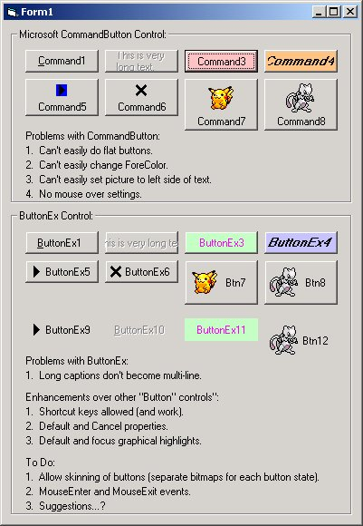



## ButtonEx

### Description

Provides an improvement/replacement for VBs CommandButton. Allows graphics on the left of the button text, mouseover graphics, flat buttons, and setting backcolor and forecolor all of which can't be done or are hard to do with VBs CommandButton.

A similar control exists on PSC called Gold Button and is by Night Wolf.
 
### More Info
 
Makes extensive use of Blitting and other Windows API calls.

Most functions have comments and have been grouped for easy reading.

I just want to say my control is similar to Gold Button, but I wrote mine from scratch and just say Night Wolf's control just before I uploaded mine.

Dizziness

             |
---                |---
**Submitted On**   |2000-08-30 15:47:58
**By**             |[Nightshadow](https://github.com/Planet-Source-Code/PSCIndex/blob/master/ByAuthor/nightshadow.md)
**Level**          |Intermediate
**User Rating**    |4.5 (45 globes from 10 users)
**Compatibility**  |VB 6\.0
**Category**       |[Custom Controls/ Forms/  Menus](https://github.com/Planet-Source-Code/PSCIndex/blob/master/ByCategory/custom-controls-forms-menus__1-4.md)
**World**          |[Visual Basic](https://github.com/Planet-Source-Code/PSCIndex/blob/master/ByWorld/visual-basic.md)
**Archive File**   |[CODE\_UPLOAD94408302000\.zip](https://github.com/Planet-Source-Code/nightshadow-buttonex__1-11113/archive/master.zip)

